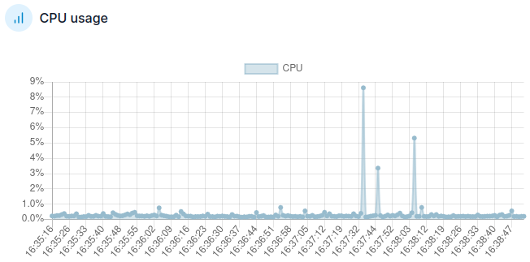

# 📊 Spring Boot - Native Images 

|                            | bootBuildImage | + upx compression  + busybox runtime                         | + upx compression  + busybox runtime  + mem optimizations | + upx compression  + busybox runtime  + mem optimizations + aggressive optimizations | + upx compression  + busybox runtime  + mem optimizations + trade-off optimizations                                       |
|----------------------------|----------------|------------------------------------------------------------------------------------|------------------------------------------------------------------------------------|------------------------------------------------------------------------------------------------------------------|------------------------------------------------------------------------------------------------------------------------------------|
| Build Version              | 0.2.0          | 0.1.0                                                                              | 0.3.0                                                                              | 0.4.0                                                                                                            | 0.5.0                                                                                                                              |
| Build Environment          | ubuntu jammy   | BP_NATIVE_IMAGE BP_BINARY_COMPRESSION_METHOD:upx                                | BP_NATIVE_IMAGE BP_BINARY_COMPRESSION_METHOD:upx -R:MaxHeapSize=48m          | BP_NATIVE_IMAGE BP_BINARY_COMPRESSION_METHOD:upx -R:MaxHeapSize=48m -O3 (best performance)              | BP_NATIVE_IMAGE BP_BINARY_COMPRESSION_METHOD:upx -R:MaxHeapSize=48m -O1 (trades performance for file size and build time) |
| Runtime Environment        | ubuntu jammy   | busybox:stable-glibc                                                               | busybox:stable-glibc                                                               | busybox:stable-glibc                                                                                             | busybox:stable-glibc                                                                                                               |
| Build Time                 | 1m 57s         | 11m 27s                                                                            | 8m 36s                                                                             | 12m 29s                                                                                                          | 11m 11s                                                                                                                            |
| Build Image Size           | 271.4 MB       | 39.2 MB                                                                            | 39.3 MB                                                                            | 39.3 MB                                                                                                          | 39.3 MB                                                                                                                            |
| Container Memory Usage     | 300 MB         | 274 MB (docker run w/o limit) 125 MB (docker run --memory=120m --memory-swap=0) | 197 MB (docker run w/o limit)  90 MB (docker run --memory=116m --memory-swap=0) | 203 MB (docker run w/o limit)  88 MB (docker run --memory=116m --memory-swap=0)                               | 203 MB (docker run w/o limit)  91 MB (docker run --memory=116m --memory-swap=0)                                                 |
| CPU Usage Idle/Load        | 0.2-0.5%/9%    | 0% / 2%                                                                            | 0% / 2%                                                                            | 0% / 20%                                                                                                         | 0% / 12%                                                                                                                           |
| Application Response Times | 0ms            | 0ms                                                                                | 0ms                                                                                | 0ms                                                                                                              |                                                                                                                                    |

0.5.0
-O1
11m 11s

| Description              | Build Time     | Image Size |
|--------------------------|----------------|------------|
| BP_NATIVE_IMAGE with upx | 15m 33s        | ✅ Aktiv    |
| Eintrag 2                | Beispieltext 2 | ❌ Inaktiv  |

# Appendix

docker run --rm --name "native-image-0.1" -p 8080:8080 spring-boot-native-image:0.1.0